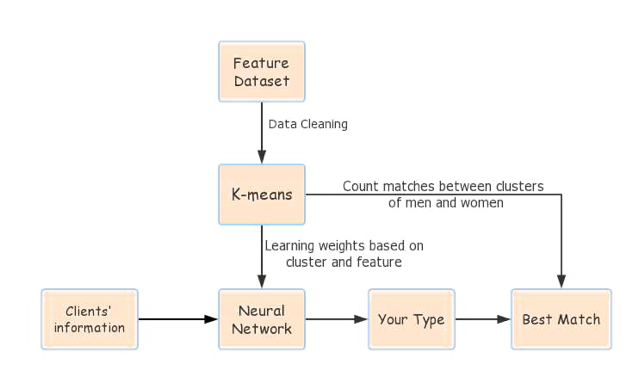
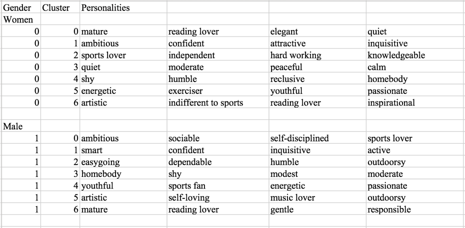
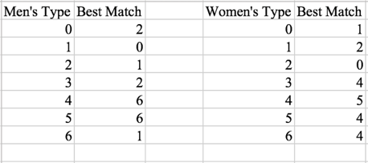

# The Secret Sauce of Dating
# Research on the Results of a Speed-Dating Experiment

Data Analytics Final Project Report

The Secret Sauce of Dating: Research on the Results of a Speed-Dating Experiment

Group: Yi Ai, Xin Yan, Xin Wen, Yijia Li

Dataset
+ The dataset we use is from a speed-dating experiment conducted by two Columbia Business School professors, Ray Fisman and Sheena Iyengar, and covers about 8,000 dates gone on by 551 participants from 2002 to 2004.
+ During the experiments, each participant had a four-minute speed date with every other participant of the opposite sex in the same group. (There were 21 groups comprising an unfixed number of members of both sexes.) 
+	At the end of each speed date, participants were asked to score six personal attributes of their date (Attractiveness, Sincerity, Intelligence, Fun, Ambition, and Shared Interests) and to answer yes or no regarding whether they would like to see their date again. 
+	The dataset also includes some other important data gathered from the participants: demographics, dating habits, self-perception across key attributes, beliefs on what others find valuable in a mate, and lifestyle information.
 
Research Goals
+	In the immediate term, find the features of successful dating and improve the development of speed dating.
+	In the long term, apply the findings from this speed-dating research to other contexts (e.g., job interviews, supervisor–subordinate workplace relationships).

Research Questions
1.	What did members of each sex think that members of the other sex wanted?
2.	What were the favorite activities of participating women and men who got high scores from their dates?
3.	Did participants pursuing different professions like to choose each other for dating?
4.	How did commonality affect speed dating’s match rate?
5.	How can people, in general, identify their own type and their best match type?

Research Results

1. What did members of each sex think that members of the other sex wanted? 

Description of the question:
+	In other words, we considered what made one person more datable than another. 
+	We looked at the pre-date surveys that asked participants what they looked for in a partner and what they thought the opposite sex looked for. 
+	It was a 100-point scale, and participants were asked to divide those 100 points among attractiveness, intelligence, fun, sincerity, ambition and shared interests. 

Results:
+	Participating females thought that the participating males (1) would value attractiveness and shared interests much more than the males actually did and (2) would value intelligence much less than the males actually did.
+	Participating males thought that the participating females (1) would value attractiveness much more than the females actually did and (2) would value intelligence much less than the females actually did. 
+	Surprisingly, both male participants and female participants thought that their dates would value attractiveness more than the dates generally did. Though we are conducting research on speed dating, which prioritizes first impressions over long-term compatibility, the participants did not assign an extremely high value to attractiveness. 

2.  What were the favorite activities of participating women and men who got high scores from their dates?

Description of the question:
+	After the speed dates, the participants gave a score based on how much they liked their dates on a scale of 1 to 10.
+	Again on a scale of 1 to 10, the participants scored how interested they were in each of the following 17 activities (sports, tv sports, exercise, dining, museums, art, hiking, gaming, clubbing, reading, tv, theater, movies, concerts, music, shopping, yoga).
+	For women and men who got high scores (higher than 7) from their date, we analyzed their interest in the 17 types of activities and visually depicted it in two word clouds (one for men and the other for women).

Results:
+	Women who got high scores from their dates liked dining, movies, music, reading, and theater the most.
+	Men who got high scores from their dates liked dining, sports, movies, music, and exercise the most.

3.  Did participants pursuing different professions like to choose each other for dating? 

Description of the question:
+	In other words, we considered whether or not professional fields were associated with the match results of the participants.
+	We streamlined eighteen fields into seven fields (Arts, Business, Engineering, Law, Liberal Arts, Natural Sciences, Social Sciences). On this basis, we analyzed participants’ attraction to dates.
+	Using the survey results, we drew a heat map. The greater the match between participants of different fields, the darker the color on the map.

Results:
+ The most likely match was between participants in Business and participants in the Social Sciences. Thus, we speculated that because people in Business are perhaps more outgoing than people in the Social Sciences, and because people in the Social Sciences are perhaps more reliable than people in Business, the two cohorts complement each other.  
+	The second most likely match was between Business participants. 
+	The third most likely match was either between participants in the Social Sciences or between participants in the Natural Sciences. 

4.  How did commonality affect speed dating’s match rate? 

Description of the question:
+	We examined similar and dissimilar people’s match rates.
+	We used LASSO to identify which personal characteristics (26 in total) were significantly associated with match rates.

Results:
+	For the speed dating of similar people, the match rate is 32.6%.
+	For the speed dating of dissimilar people, the match rate is 21.4%. 
+	Similarity for the characteristics of age, socializing, tv-sports viewing, reading habits, general tv viewing, clubbing, and sense of humor was associated with high match rates. 

5. How can people, in general, identify their own type and their best match type?

Description of the question:
+	First, we applied K-means to divide participants into 7 clusters for each sex. In determining the number of clusters, we used results from a silhouette plot. 
+	We tagged each cluster according to the average of each of the 26 personal characteristics, and then we determined the best matches between a given male cluster and a given female cluster. 
+	After that, we used a neural network to identify the relationships (i.e., the weights) between characteristics and clusters. When our Website’s users submit their information, the neural network will place them in the most suitable cluster. 

Results:
+	On the basis of the mean of each characteristic (26 in total) for the seven clusters, we summarized each cluster’s personalities (exemplification). 

+	 On the basis of the neural-network results, we found the following results:

